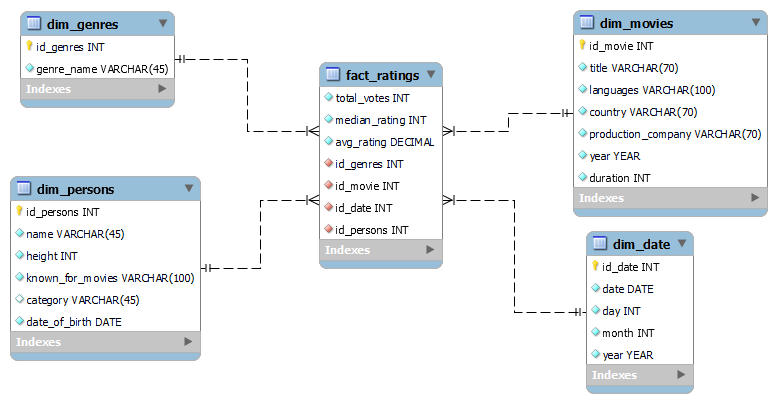

**ETL process on the IMDb dataset**
---
Tento repozitár obsahuje implementáciu ETL procesu nad datasetom IMDb. Projekt zahŕňa: extrahovanie udajov, transformáciu a následné načítanie dát do modelu hviezdy v Snowflake. Následne sa vykonáva analýza dát cez tento model a ich vizualizácia.

----
## **1. Úvod a popis zdrojových dát**
в процесе

### Zdrojove data:
- `names.csv`	-- informácie o osobách
- `ratings.csv` -- hodnotenia filmov
- `movies.csv`  -- informácie o filmoch
- `genre.csv` -- filmové žánre
- `director_mapping.csv` -- relačná tabuľka N:M pre režisérov
- `role_mapping.csv` -- relačná tabuľka N:M pre hercov

ETL proces nam pripraví, transformuje a umožní multidimenzionálnu analýzu našich údajov
___
### **1.1 Dátová architektúra**
**ERD diagram**
Na začiatku sú údaje uložené v relačnom modeli, ktorého ERD je znázornený nižšie

  
   
  <em>Obrázok 1 Entitno-relačná schéma IMDB</em>

---

## **2.  Dimenzionálny model**

Pôvodná schéma bola transformovaná na *star schému* pre efektívnu analýzu. Centrálnou tabuľkou je `fact_ratings`, ktorej údaje budeme ďalej analyzovať.
K nej sú pripojené tri tabuľky dimenzii:

 - `dim_movies` -- obsahuje informácie o filmoch
 - `dim_genres` -- obsahuje názvy žánrov
 - `dim_persons` -- obsahuje osoby spojené s filmom. Ak je osoba hercom, `category` bude obsahovať informácie o jej hereckej kategórii

Nižšie je uvedený diagram hviezdicového modelu vytvorený v programe MySQL Workbench

  
   
  <em>Obrázok 2 Schéma hviezdy pre IMDB</em>

