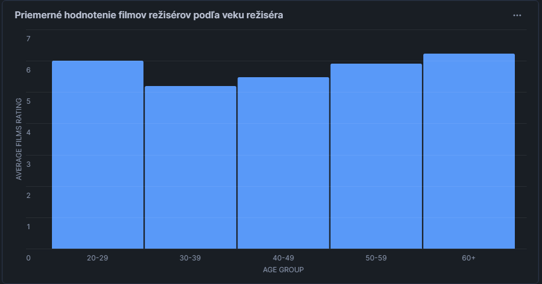

**ETL process on the IMDb dataset**
---
Tento repozitár obsahuje implementáciu ETL procesu nad datasetom IMDb. Projekt zahŕňa: extrahovanie udajov, transformáciu a následné načítanie dát do modelu hviezdy v Snowflake. Následne sa vykonáva analýza dát cez tento model a ich vizualizácia.

----
## **1. Úvod a popis zdrojových dát**
Cieľom tohto projektu je analyzovať databázu IMDb pomocou multidimenzionálneho modelu. Analýza sa týka filmov, ich počtu hlasov a hodnotení, žánrov a osôb zúčastnených na filme - hercov a režisérov. Analýza nám umožní vidieť vzájomné závislosti jednotlivých faktorov, tendencie natáčania filmov a pod. 

### Zdrojove data:
- `names.csv`	-- informácie o osobách
- `ratings.csv` -- hodnotenia filmov
- `movies.csv`  -- informácie o filmoch
- `genre.csv` -- filmové žánre
- `director_mapping.csv` -- relačná tabuľka N:M pre režisérov
- `role_mapping.csv` -- relačná tabuľka N:M pre hercov

ETL proces nam pripraví, transformuje a umožní multidimenzionálnu analýzu našich údajov
___
### **1.1 Dátová architektúra**
**ERD diagram**
Na začiatku sú údaje uložené v relačnom modeli, ktorého ERD je znázornený nižšie
<p align="center">
  
  <br>
  <em>Obrázok 1 Entitno-relačná schéma IMDB</em>
</p>

---

## **2.  Dimenzionálny model**

Pôvodná schéma bola transformovaná na *star schému* pre efektívnu analýzu. Centrálnou tabuľkou je `fact_ratings`, ktorej údaje budeme ďalej analyzovať.
K nej sú pripojené tri tabuľky dimenzii:

 - `dim_movies` -- obsahuje informácie o filmoch
 - `dim_genres` -- obsahuje názvy žánrov
 - `dim_persons` -- obsahuje osoby spojené s filmom. Ak je osoba hercom, `category` bude obsahovať informácie o jej hereckej kategórii

Nižšie je uvedený diagram hviezdicového modelu vytvorený v programe MySQL Workbench
<p align="center">
  
  <br>
  <em>Obrázok 2 Schéma hviezdy pre IMDB</em>
</p>

## **3. ETL proces v Snowflake**
ETL proces pozostával z troch hlavných fáz: `extrahovanie` (Extract), `transformácia` (Transform) a `načítanie` (Load). Tento proces bol implementovaný v Snowflake s cieľom pripraviť zdrojové dáta zo staging vrstvy do viacdimenzionálneho modelu vhodného na analýzu a vizualizáciu.

### **3.1 Extract (Extrahovanie dát)**
Najprv bol vytvorený stage s názvom `imdbStage` pomocou nižšie uvedeného príkazu:
```sql
CREATE OR REPLACE STAGE imdbStage;
```
    
Potom boli do stage nahrané naše databázové súbory vo formáte `.csv`, ktoré obsahujú filmy, hodnotenia, žánre, režisérov a hercov.

Ďalším cieľom bolo distribuovať údaje každého súboru do vlastných staging tabuliek. Na vytvorenie staging tabuľky pre každý súbor sme použili dotaz v tvare:
   ```sql
CREATE OR REPLACE TABLE movie_staging (
    id VARCHAR(10),
    title VARCHAR(200),
    year INT,
    date_published DATE,
    duration INT,
    country VARCHAR(250),
    worlwide_gross_income VARCHAR(30) ,
    languages  VARCHAR(200),
    production_company VARCHAR(200)
);
```


Potom sa pomocou nasledujúceho príkazu načítal obsah príslušných súborov do každej tabuľky.

  ```sql
    COPY INTO movie_staging
    FROM @imdbStage/movie.csv
    FILE_FORMAT = (TYPE = 'CSV' FIELD_OPTIONALLY_ENCLOSED_BY = '"' SKIP_HEADER = 1);
```
a správnosť jeho obsahu bola overená prikazom:

  ```sql 
  SELECT * FROM movie_staging;
```
    
v prípade nekonzistentných údajov spôsobujúcich chyby bol príkaz `COPY INTO` modifikovaný parametrom:
```sql    
ON_ERROR = 'CONTINUE';
```
___
### **3.2 Transform (Transformácia dát)**
V tomto štádiu boli údaje z tabuliek zoradené a transformované. Teraz je potrebné pripraviť dimenzionálny model - tabuľky `dim` a  tabuľky `fact` pre nasledujúcu efektívnu a pohodlnú dátovú analýzu


- **`dim_movies`**
***SCD Type 2 - vytvorenie nového záznamu pri zmene atribútov.***
História zmien filmu môže byť užitočná (napr. preklad filmu do iných jazykov).

```sql
CREATE OR REPLACE TABLE dim_movies AS
SELECT DISTINCT 
    id AS id_movie,
    title,
    languages,
    country,
    production_company,
    year,
    duration,
    date_published
FROM movies_staging;
```
Dimenzia `dim_movies` uchováva údaje o filmoch: ich jazyky, produkčnú spoločnosť, názov, dĺžku a ďalšie informácie o filme. Dimenzia poskytuje kontext na analýzu pre tabuľku faktov `fact_ratings` v oblasti týkajúcej sa filmu a jeho podrobností
___

- **`dim_persons`**
***SCD type 2 - sledovanie histórie zmien***
Je potrebné sledovať zmeny v kariére, napríklad účasť v nových filmoch.
```sql
CREATE OR REPLACE TABLE dim_persons AS
SELECT DISTINCT 
    n.id AS id_persons,
    n.name,
    n.height,
    n.known_for_movies,
    rm.category,
    n.date_of_birth
FROM names_staging n
LEFT JOIN role_staging rm ON n.id = rm.name_id;
```
V tabuľke sú uložené informácie o všetkých osobách zúčastnených na filme. Rozdelenie na režisérov a hercov je realizované tak, že ak je `category` prázdna, ide o režiséra. V opačnom prípade sa v poli uvedie kategória herca (actor, actress). Toto riešenie bolo realizované pomocou `LEFT JOIN` s `role_staging`, čo je relačná tabuľka N:M pre hercov medzi osobami a filmami
___

- **`dim_genres`**
***SCD Type 0 - nemenné dimenzie*** 
Žánre filmov sa po nahratí filmu nikdy nemenia.
```sql
CREATE OR REPLACE TABLE dim_genres AS
SELECT DISTINCT 
    genre AS id_genres,
    genre AS genre_name
FROM genre_staging;
```
Tabuľka, v ktorej sú uložené názvy žánrov. Vďaka tomu, že žáner bol umiestnený v samostatnej dimenzii, vznikol vzťah N:M medzi filmami a žánrami, ktorý sa v pôvodnej databáze nenachádza, čo možno považovať za chybu (vzťah 1:N medzi filmami a žánrami).

Keďže `id` tabuľky je pôvodne názov žánru, pre lepšiu čitateľnosť bol vytvorený aj atribút genre_name obsahujúci názov žánru z `id`.
___

- **`fact_ratings`**
```sql
CREATE OR REPLACE TABLE fact_ratings AS
SELECT 
    r.median_rating,
    r.avg_rating,
    r.total_votes,
    dm.id_movie,
    dg.id_genres,
    dp.id_persons
FROM ratings_staging r
JOIN movie_staging m ON r.movie_id = m.id
JOIN genre_staging g ON m.id = g.movie_id
JOIN director_staging dm_map ON m.id = dm_map.movie_id
JOIN role_staging rm ON m.id = rm.movie_id
JOIN names_staging n ON rm.name_id = n.id OR dm_map.name_id = n.id
JOIN dim_movies dm ON m.id = dm.id_movie
JOIN dim_genres dg ON g.genre = dg.genre_name
JOIN dim_persons dp ON n.id = dp.id_persons;
```
Сentrálna tabuľka - tabuľka faktov obsahujúca údaje na analýzu - metriky. V tomto prípade sa analýza bude vykonávať nad tabuľkou ratings a jej hodnotách.

Nemôžeme sa pripojiť priamo ku všetkým dimenziám naraz, preto je potrebné najprv získať údaje z príslušných staging tabuliek. Pomocou týchto údajov následne vytvoríme správne `ID` pre každú dimenziu, ktoré nám umožní pripojiť sa k dim-tabuľkám.
___

### **3.3 Load (Načítanie dát)**
Po úspešnom vytvorení nášho multidimenzionálneho modelu - dim tabuliek prepojených centrálnou tabuľkou fact_ratings boli do nej úspešne načítané údaje. V tomto okamihu už nie sú tabuľky staging potrebné a mali by byť odstránené z dôvodu efektívneho využitia úložiska.
```sql
DROP TABLE IF EXISTS movie_staging;
DROP TABLE IF EXISTS ratings_staging;
DROP TABLE IF EXISTS names_staging;
DROP TABLE IF EXISTS genre_staging;
DROP TABLE IF EXISTS role_staging;
DROP TABLE IF EXISTS director_staging;
```
Teraz vytvorený hviezdny model naplnený údajmi zo súborov `.csv` nám umožní efektívne a pohodlne analyzovať databázu IMDB.


## **4 Vizualizácia dát**
Nižšie je uvedených 6 dashboards so štatistikami vytvorenými pomocou SQL dotazov  v Snowflake.

### 1  - Top žánre podľa priemerného hodnotenia
<p align="center">
  
  <br>
  <em>Obrázok 3: Top žánre podľa priemerného hodnotenia</em>
</p>

```sql
SELECT 
    dg.genre_name AS genre,
    AVG(fr.avg_rating) AS avg_genre_rating
FROM fact_ratings fr
JOIN dim_genres dg ON fr.id_genres = dg.id_genres
GROUP BY dg.genre_name
ORDER BY avg_genre_rating DESC
LIMIT 7;
```

V grafe sú zobrazené najlepšie hodnotené žánre v rámci priemerného hodnotenia filmu v jednotlivých žánroch. Jasne vidíme, že najlepšie hodnotené sú filmy so žánrami dráma a romantika. Graf zobrazuje len 7 najlepšie hodnotených žánrov.
___
### 2 -  Porovnanie počtu filmov natočených na kontinentoch: Európa, Amerika, Ázia
<p align="center">
  
  <br>
  <em>Obrázok 4: Tendencia natáčať filmy na kontinentoch</em>
</p>

```sql
SELECT 
    CASE
        WHEN dm.country IN ('USA', 'Canada', 'Mexico', 'Brazil', 'Columbia', 'Chili', 'Argentina', 'Venezuela') THEN 'America'
        WHEN dm.country IN ('Germany', 'France', 'UK', 'Spain', 'Italy', 'Poland', 'Netherlands', 'Sweden', 'Belgium', 'Slovakia') THEN 'Europe'
        WHEN dm.country IN ('China', 'India', 'Japan', 'South Korea', 'Indonesia', 'Pakistan', 'Bangladesh', 'Philippines', 'Vietnam', 'Turkey') THEN 'Asia'
    END AS region,
    dm.year AS release_year,
    COUNT(*) AS movie_count
FROM dim_movies dm
WHERE dm.country IN ('USA', 'Canada', 'Mexico', 'Brazil', 'Columbia', 'Chili', 'Argentina', 'Venezuela')
   OR dm.country IN ('Germany', 'France', 'UK', 'Spain', 'Italy', 'Poland', 'Netherlands', 'Sweden', 'Belgium', 'Slovakia')
   OR dm.country IN ('China', 'India', 'Japan', 'South Korea', 'Indonesia', 'Pakistan', 'Bangladesh', 'Philippines', 'Vietnam', 'Turkey')
GROUP BY region, dm.year
ORDER BY dm.year ASC;
```

Graf znázorňuje počet filmov natočených na troch kontinentoch: Európa, Amerika, Ázia. Všetky tri vykazujú klesajúcu tendenciu v počte nakrútených filmov. V každom roku sa najviac filmov natočí v Amerike a najmenej v Európe. Do úvahy sa bralo 10 najväčších krajín každého kontinentu (Severná a Južná Amerika spolu).
___

### 3  - Počet filmov natočených v jednotlivých krajinách podľa rokov
<p align="center">
  
  <br>
  <em>Obrázok 5: Počet filmov natočených v jednotlivých krajinách podľa rokov</em>
</p>

```sql
SELECT 
    dm.country AS country,
    dm.year AS release_year,
    COUNT(dm.id_movie) AS movie_count
FROM dim_movies dm
WHERE dm.country IN ('USA', 'India', 'France', 'Japan', 'UK', 'Germany')
GROUP BY dm.country, dm.year
ORDER BY dm.country, dm.year;
```

Tento graf zobrazuje počet filmov nakrútených v jednotlivých rokoch, ale nie podľa kontinentov, ale podľa desiatich najväčších krajín mediálnych producentov. V počte vyrobených filmov sú na čele dve krajiny: USA a India. V Európe má najväčší počet vyrobených filmov Spojené kráľovstvo
___

### 4 - Porovnanie priemerného hodnotenia nemeckých a amerických filmov
<p align="center">
  
  <br>
  <em>Obrázok 6: Porovnanie priemerného hodnotenia nemeckých a amerických filmov</em>
</p>

```sql
SELECT 
    CASE 
        WHEN dm.country LIKE '%Germany%' THEN 'Germany'
        WHEN dm.country LIKE '%USA%' THEN 'USA'
    END AS country,
    AVG(fr.avg_rating) AS average_rating
FROM fact_ratings fr
JOIN dim_movies dm ON fr.id_movie = dm.id_movie
WHERE dm.country LIKE '%Germany%' OR dm.country LIKE '%USA%'
GROUP BY country;
```

Graf ukazuje, ako sú v priemere hodnotené filmy dvoch veľkých štátov, USA a Nemecka. Rozdiel je 0,3 hodnotiacich jednotiek, z čoho môžeme usúdiť, že hoci si nemecké filmy držia vysokú známku, americká filmová produkcia v kvalite príliš nezaostáva.
___

### 5  -  Priemerné hodnotenie filmov režisérov podľa veku režiséra
<p align="center">
  
  <br>
  <em>Obrázok 7: Priemerné hodnotenie filmov režisérov podľa veku režiséra</em>
</p>

```sql
SELECT
    CASE
        WHEN (DATE_PART('year', CURRENT_DATE) - DATE_PART('year', dp.date_of_birth)) BETWEEN 20 AND 29 THEN '20-29'
        WHEN (DATE_PART('year', CURRENT_DATE) - DATE_PART('year', dp.date_of_birth)) BETWEEN 30 AND 39 THEN '30-39'
        WHEN (DATE_PART('year', CURRENT_DATE) - DATE_PART('year', dp.date_of_birth)) BETWEEN 40 AND 49 THEN '40-49'
        WHEN (DATE_PART('year', CURRENT_DATE) - DATE_PART('year', dp.date_of_birth)) BETWEEN 50 AND 59 THEN '50-59'
        WHEN (DATE_PART('year', CURRENT_DATE) - DATE_PART('year', dp.date_of_birth)) >= 60 THEN '60+'
        ELSE 'Unknown'
    END AS age_group,
    AVG(fr.avg_rating) AS average_rating
FROM fact_ratings fr
JOIN dim_movies dm ON fr.id_movie = dm.id_movie
JOIN dim_persons dp ON fr.id_persons = dp.id_persons
WHERE dp.category IS NULL  
GROUP BY age_group
ORDER BY age_group;
```

Graf, ktorého cieľom je zistiť, či vek režiséra ovplyvňuje hodnotenie filmu, ktorý natočil, a aký vek režisérov v priemere vytvára najlepšie filmy. Ako možno vidieť, najlepší režiséri sú tí, ktorí majú viac ako 60 rokov a majú veľa skúseností vo filmovom priemysle. Zatiaľ na druhom mieste sú mladí režiséri vo veku 20-29 rokov, ktorí pravdepodobne držia kvalitu filmov vďaka svojim inovatívnym nápadom
___

### 6  - Vzťah medzi počtom hlasov filmu a jeho dĺžkou trvania
<p align="center">
  
  <br>
  <em>Obrázok 8: Vzťah medzi počtom hlasov filmu a jeho dĺžkou trvania
</em>
</p>

```sql
SELECT 
    dm.duration AS movie_duration,  
    fr.total_votes AS total_votes, 
    dm.year AS release_year
FROM fact_ratings fr
JOIN dim_movies dm ON fr.id_movie = dm.id_movie
ORDER BY release_year ASC;
```

Graf, ktorý znázorňuje vzťah medzi dĺžkou filmu a počtom hlasov. Je vidieť, že najviac hlasov majú filmy, ktoré trvajú 100-150 minút - od 4 miliónov hlasov až po 17 miliónov. Menší počet hlasov majú filmy, ktoré trvajú 80-100 minút. - v okolí jedného milióna.
Spodná časť grafu tiež ukazuje, že väčšina filmov bez ohľadu na ich dĺžku nedostávala viac ako pol milióna hlasov.
___

**Author:** *Mykhailo M. Dudash* 
